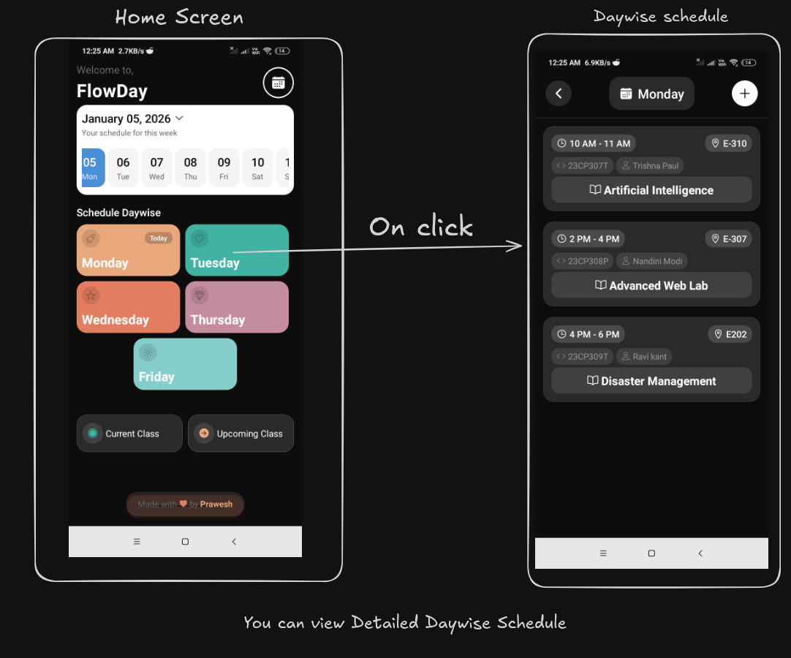
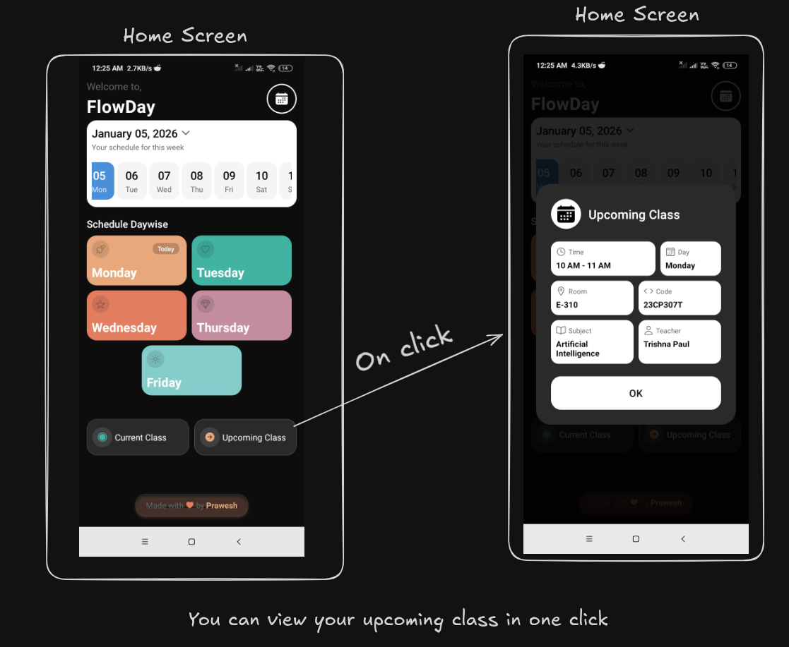
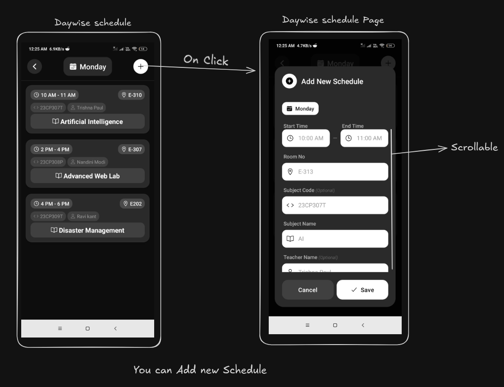
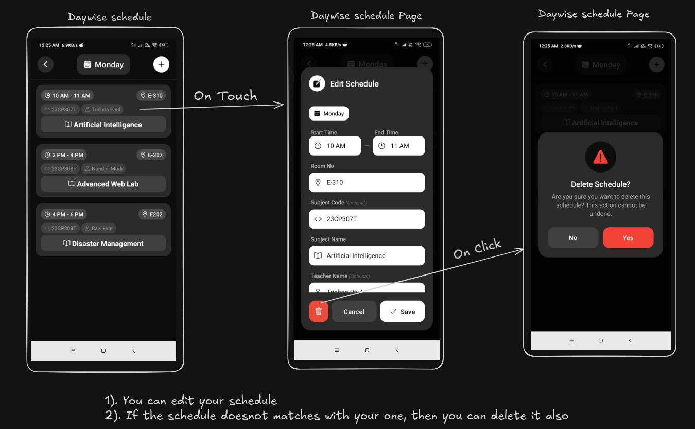

# FlowDay

Offline-first weekly class routine manager built with Expo, React Native, and SQLite.

[](https://github.com/[PLACEHOLDER_OWNER]/[PLACEHOLDER_REPO]/releases)

## Project Overview

FlowDay is a mobile-first timetable app for students who need a clean weekly view of classes with quick create/edit/delete flows and instant "current class" and "upcoming class" lookups.

---

## Screenshots

<table>
  <tr>
    <td></td>
    <td></td>
  </tr>
  <tr>
    <td></td>
    <td></td>
  </tr>
</table>

---

## Features

### Student Schedule Features

- Day-wise schedule view for weekdays with quick navigation.
- Add new schedule entries with time, room, subject details, and teacher info.
- Edit existing entries from the day screen.
- Delete entries with confirmation modal.
- Empty state handling for days without schedules.

### Data and Persistence

- Local SQLite database (`flowday.db`) initialized on app startup.
- Auto-creation of `schedules` table.
- One-time sample data prepopulation for first launch.

---

## Tech Stack

| Layer           | Technology                   | Version                                        |
| --------------- | ---------------------------- | ---------------------------------------------- |
| Language        | TypeScript                   | `~5.9.2`                                       |
| Runtime         | Node.js                      | `20.19.6`                                      |
| Framework       | React Native                 | `0.81.5`                                       |
| UI Library      | React                        | `19.1.0`                                       |
| App Platform    | Expo                         | `~54.0.30`                                     |
| Navigation      | Expo Router                  | `~6.0.21`                                      |
| Database        | Expo SQLite                  | `~16.0.10`                                     |
| Icons           | Expo Vector Icons (Ionicons) | `^15.0.3`                                      |
| Linting         | ESLint + Expo config         | `eslint ^9.25.0`, `eslint-config-expo ~10.0.0` |
| Build/Release   | EAS Build / EAS Submit       | `eas.json` configured                          |
| Package Manager | npm                          | `10.8.2`                                       |

---

## Project Structure

<details>
<summary>Directory tree</summary>

```text
flowday/
├── app/                                # Expo Router app directory (file-based routes)
│   ├── _layout.tsx                     # Root layout, safe area + global stack + DB init side-effect
│   ├── modal.tsx                       # Compatibility placeholder route
│   └── (tabs)/                         # Main route group
│       ├── _layout.tsx                 # Group-level stack configuration
│       ├── index.tsx                   # Home route entry, re-exports HomeScreen
│       └── day/
│           └── [day].tsx               # Dynamic day route entry, re-exports DayScheduleScreen
├── src/
│   ├── screens/
│   │   ├── HomeScreen.tsx              # Dashboard, date strip, day cards, current/upcoming modals
│   │   ├── DayScheduleScreen.tsx       # Day detail page, schedule list, add/edit/delete flows
│   │   └── index.ts                    # Screen exports
│   ├── components/
│   │   ├── AddScheduleModal/           # Add/edit form modal component
│   │   ├── ClassInfoModal/             # Current/upcoming class info modal
│   │   ├── DeleteModal/                # Delete confirmation modal
│   │   ├── ScheduleCard/               # Individual schedule card UI
│   │   ├── ActionButton/               # Reusable action button (available component)
│   │   ├── DayButton/                  # Reusable day button (available component)
│   │   └── index.ts                    # Component barrel exports
│   ├── db/
│   │   ├── database.ts                 # SQLite connection, schema init, seed data
│   │   ├── scheduleDao.ts              # CRUD and query logic (current/upcoming/day views)
│   │   └── index.ts                    # DB exports
│   ├── theme/
│   │   ├── colors.ts                   # Color tokens
│   │   ├── spacing.ts                  # Spacing, radius, layout constants, shadows
│   │   ├── typography.ts               # Typography tokens
│   │   └── index.ts                    # Theme exports
│   ├── types/
│   │   ├── Schedule.ts                 # Schedule types and day constants
│   │   └── index.ts                    # Type exports
│   └── utils/
│       ├── timeUtils.ts                # Time parsing/formatting/validation/sorting helpers
│       └── index.ts                    # Utility exports
├── assets/
│   ├── android/                        # Android launcher/web/play-store assets
│   └── ios/                            # iOS app icon assets
├── data/                               # Legacy routine data layer (not primary runtime path)
│   ├── db/
│   ├── repository/
│   └── *.ts
├── hooks/                              # Expo template hooks
├── scripts/
│   └── reset-project.js                # Starter reset script
├── viewmodel/
│   └── useDayViewModel.ts              # View model helper (currently not wired in routes)
├── app.json                            # Expo app config (bundle IDs, scheme, plugins)
├── eas.json                            # EAS build/submit profiles
├── eslint.config.js                    # Lint configuration
├── tsconfig.json                       # TypeScript config
├── package.json                        # Scripts and dependencies
└── README.md                           # Project documentation
```

</details>

---

## Prerequisites

- Expo account for EAS Build/Submit

---

## Installation and Setup

### 1. Clone the Repository

```bash
git clone https://github.com/prawesh-12/flowday-app.git
cd flowday
```

### 2. Install Dependencies

macOS and Linux:

```bash
npm install
```

Windows (PowerShell):

```powershell
npm install
```

---

## Running the Project

### Development Mode

```bash
npm start
```

### Run on Android Emulator

```bash
npm run android
```

### Run on iOS Simulator

```bash
npm run ios
```

### Run on Web

```bash
npm run web
```

### Linting

```bash
npm run lint
```

---

### Production Build Commands

Web static export:

```bash
npx expo export --platform web
```

Android APK:

```bash
npx eas build --platform android --profile production-apk
```

Android App Bundle (Play Store):

```bash
npx eas build --platform android --profile production
```

iOS build:

```bash
npx eas build --platform ios --profile production
```

---

### Android Device Setup

Emulator:

1. Install Android Studio.
2. Create and start an AVD.
3. Run `npm run android`.

Physical device:

1. Install Expo Go from Play Store.
2. Run `npm start`.
3. Scan the QR code from Expo CLI output.

---

## API Documentation

FlowDay does not expose any remote HTTP API. It uses an internal SQLite data API through `scheduleDao` in `src/db/scheduleDao.ts`.

### Internal Data API (SQLite + DAO)

Database: `flowday.db`  
Table: `schedules`

```sql
CREATE TABLE IF NOT EXISTS schedules (
  id TEXT PRIMARY KEY NOT NULL,
  day TEXT NOT NULL,
  startTime TEXT NOT NULL,
  endTime TEXT NOT NULL,
  startMinutes INTEGER NOT NULL,
  endMinutes INTEGER NOT NULL,
  room TEXT NOT NULL,
  subjectCode TEXT NOT NULL,
  subjectName TEXT NOT NULL,
  teacherName TEXT NOT NULL
);
```

#### `getByDay(day: string): Schedule[]`

- Description: Returns all schedules for a day sorted by start time.
- Example:

```ts
const mondaySchedules = scheduleDao.getByDay("Monday");
```

#### `getAll(): Schedule[]`

- Description: Returns all schedules in the database.
- Example:

```ts
const allSchedules = scheduleDao.getAll();
```

#### `getById(id: string): Schedule | null`

- Description: Returns one schedule by ID.
- Example:

```ts
const schedule = scheduleDao.getById("f9f6c5f2-9d42-4e74-8ec5-6ef2d6174db3");
```

#### `insert(schedule: Omit<Schedule, "id" | "startMinutes" | "endMinutes">): Schedule`

- Description: Inserts a new schedule and auto-calculates `startMinutes` and `endMinutes`.
- Input example:

```json
{
    "day": "Monday",
    "startTime": "10:00 AM",
    "endTime": "11:00 AM",
    "room": "E-310",
    "subjectCode": "23CP307T",
    "subjectName": "AI",
    "teacherName": "Trishna Paul"
}
```

- Output example:

```json
{
    "id": "generated-uuid",
    "day": "Monday",
    "startTime": "10:00 AM",
    "endTime": "11:00 AM",
    "startMinutes": 600,
    "endMinutes": 660,
    "room": "E-310",
    "subjectCode": "23CP307T",
    "subjectName": "AI",
    "teacherName": "Trishna Paul"
}
```

#### `update(schedule: Schedule): void`

- Description: Updates an existing schedule by `id`.
- Example:

```ts
scheduleDao.update({
    id: "existing-id",
    day: "Tuesday",
    startTime: "11:00 AM",
    endTime: "12:00 PM",
    startMinutes: 0,
    endMinutes: 0,
    room: "E-307",
    subjectCode: "23CP316T",
    subjectName: "Cloud Computing",
    teacherName: "Punit Gupta",
});
```

#### `delete(id: string): void`

- Description: Deletes a schedule by ID.
- Example:

```ts
scheduleDao.delete("existing-id");
```

#### `getCurrentClass(): Schedule | null`

- Description: Returns the class currently in progress based on system date/time.
- Notes: Uses current weekday and minute range check: `startMinutes <= now < endMinutes`.

#### `getUpcomingClass(): Schedule | null`

- Description: Returns the next class for today or next weekday if today has no future classes.
- Notes: Skips weekend days when searching forward.

---

## License

MIT — see [LICENSE](LICENSE)
